<div align="center">

<a href="https://github.com/shreeharsh-patil/Taj-Mahal">
  
</a>

<br />


<br />

**A fully procedural, interactive 3D journey through the Taj Mahal.**  
*No downloaded 3D models. No external texture assets. Just geometry, light, and code.*

<br />

<a href="https://github.com/shreeharsh-patil/Taj-Mahal/stargazers"></a>
<a href="https://github.com/shreeharsh-patil/Taj-Mahal/forks"></a>


<br /><br />

<a href="#-the-experience">The Experience</a> &nbsp;·&nbsp;
<a href="#-get-started">Get Started</a> &nbsp;·&nbsp;
<a href="#-controls">Controls</a> &nbsp;·&nbsp;
<a href="#-under-the-hood">Under the Hood</a>

</div>

---

## 🕌 The Experience

Step into a digital interpretation of **the Taj Mahal in Agra, India**, brought to life with **Three.js, React, TypeScript, and Vite**. Explore the mausoleum, minarets, gardens and reflective water from different angles, then watch the atmosphere change with the sun.

Everything is drawn in real time using procedurally generated geometry and textures rather than prebuilt 3D models. The result is an immersive, interactive scene that can be bundled into **one self-contained HTML file**.

<table>
<tr>
<td width="50%" valign="top">

### ✨ Architectural detail
Pointed arches, an onion dome, smaller chhatris, intricate façades, four minarets, marble and sandstone materials.

</td>
<td width="50%" valign="top">

### 🎥 Cinematic exploration
An animated introduction, smooth camera transitions, four curated viewpoints and an automated cinematic tour.

</td>
</tr>
<tr>
<td valign="top">

### 🌅 Living atmosphere
Morning, daylight and sunset presets, drifting sunlight, volumetric-feeling haze, clouds, shadows and birds.

</td>
<td valign="top">

### 💧 Reflective gardens
A charbagh-inspired garden, water channels, shimmering planar reflections, paths, lawns and trees.

</td>
</tr>
<tr>
<td valign="top">

### 🖱️ Explore your way
Orbit, pan and zoom with mouse or touch; use keyboard shortcuts and switch to fullscreen.

</td>
<td valign="top">

### 📱 Adaptive rendering
Reduced texture and reflection budgets, lower multisampling and disabled bloom on more constrained mobile devices.

</td>
</tr>
</table>

## 🚀 Get Started

**Prerequisites:** A current Node.js installation, npm, and a browser with WebGL support.

**1. Clone the project**

```bash
git clone https://github.com/shreeharsh-patil/Taj-Mahal.git
cd Taj-Mahal
```

**2. Install dependencies**

```bash
npm install
```

**3. Run the development server**

```bash
npm run dev
```

Open the local URL printed by Vite (usually **http://localhost:5173**).

**Build for deployment**

```bash
npm run build
npm run preview
```

The Vite single-file plugin bundles the app into `dist/index.html`. You can deploy it to a static host or open the built file locally.

## 🎮 Controls

| Action | Mouse / touch | Keyboard |
| :--- | :--- | :---: |
| **Orbit** around the monument | Left-drag / one-finger drag | — |
| **Pan** the scene | Right-drag | — |
| **Zoom** in and out | Mouse wheel / pinch | — |
| **Front view** | Front View button | `1` |
| **Aerial view** | Aerial View button | `2` |
| **Close view** | Close View button | `3` |
| **Garden view** | Garden View button | `4` |
| **Reset camera** | Reset Camera button | `R` |
| **Cinematic tour** | Cinematic Tour / Stop Tour button | `T` |
| **Fullscreen** | Fullscreen button | `F` |
| **Change lighting** | Morning / Day / Sunset / Sun Drift | — |

> **Tip:** Start the cinematic tour for a guided flythrough. Dragging, scrolling or touching the scene interrupts the tour so you can explore freely.

## 🧱 Built With

<div align="center">


<br /><br />

**Three.js** · **WebGL** · **React 19** · **TypeScript** · **Vite 7** · **Tailwind CSS 4**

</div>

## 🛠️ Under the Hood

The experience builds the scene from code and then hands it to a real-time rendering pipeline.

```text
React UI + control bar
         │
         ▼
  TajExperience
         │
         ├── Procedural architecture
         │   ├── Mausoleum + dome + minarets
         │   └── Platform, mosque and gardens
         │
         ├── Materials + generated textures
         ├── Sky, sunlight, shadows and atmosphere
         ├── Camera presets + cinematic tour
         ├── Reflective water
         └── Rendering + post-processing
```

<details>
<summary><strong>📁 Explore the source structure</strong></summary>

```text
Taj-Mahal/
├── assets/
│   └── taj-mahal-animated.svg   # Animated README illustration
├── index.html                   # Browser entry point
├── src/
│   ├── main.tsx                 # React bootstrap
│   ├── App.tsx                  # Loading screen, HUD, controls
│   ├── index.css                # Glass UI and canvas styling
│   └── taj/
│       ├── experience.ts        # Scene lifecycle and rendering loop
│       ├── environment.ts       # Sky, sunlight, clouds and presets
│       ├── camera.ts            # Views, orbit controls and tour
│       ├── post.ts              # Bloom, tone mapping, image grading
│       ├── water.ts             # Reflection, ripples and glints
│       ├── garden.ts            # Gardens, trees and pool
│       ├── platform.ts          # Plinth, terrace and side buildings
│       ├── mausoleum.ts         # Main tomb and dome
│       ├── minaret.ts           # Four minarets
│       ├── parts.ts             # Reusable architectural forms
│       ├── geo.ts               # Geometry construction helpers
│       ├── materials.ts         # PBR material library
│       └── textures.ts          # Procedurally generated textures
├── vite.config.ts               # Single-file production build
└── package.json
```

</details>

<details>
<summary><strong>🔍 Technical highlights</strong></summary>

- **Architecture proportions:** Inspired by the real site: a 95 m plinth, 56 m chamfered mausoleum, approximately 41 m minarets, and a 300 m garden axis.
- **Procedural domes:** A lathed, smooth Bézier-profile onion dome, lotus collar, gilded finial and reusable chhatri shapes.
- **Intricate façades:** Extruded pointed arches, recessed openings, floral inlay details, calligraphy-like framing and jali patterns.
- **Physically based surfaces:** Procedural marble, sandstone, grass and ornamental textures; world-space texture projection helps avoid stretching.
- **Lighting and water:** Environment lighting, cinematic grading, bloom, ACES tone mapping and Fresnel-based planar water reflection.
- **Optimized scene:** Geometries merged by material, instanced vegetation and device-aware rendering settings.

</details>

## 🌍 A Monument, Reimagined

Built as a creative coding and 3D graphics project celebrating the visual beauty of one of India's most iconic landmarks. This is an **artistic, interactive recreation**, not an official heritage survey or a photogrammetric digital twin.

The animated cover illustration is included in this repository at [`assets/taj-mahal-animated.svg`](./assets/taj-mahal-animated.svg). Its visual motion is decorative; the real experience is fully interactive in the app.

## 🤝 Contributing

Suggestions, bug reports and improvements are welcome. Open an [issue](https://github.com/shreeharsh-patil/Taj-Mahal/issues) to discuss an idea, or submit a pull request with a clear description of your change.

---

<div align="center">

### ✨ Made with code, curiosity & an appreciation for architecture

Created by **[Shreeharsh Patil](https://github.com/shreeharsh-patil)**

<a href="https://github.com/shreeharsh-patil/Taj-Mahal">View Repository</a> · <a href="https://github.com/shreeharsh-patil/Taj-Mahal/issues">Report an Issue</a> · <a href="https://github.com/shreeharsh-patil/Taj-Mahal/stargazers">Star the Project ⭐</a>

<sub>Explore the monument. Follow the light. Discover the details.</sub>

</div>
